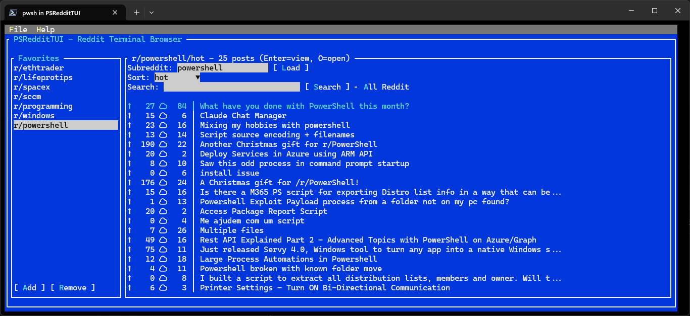
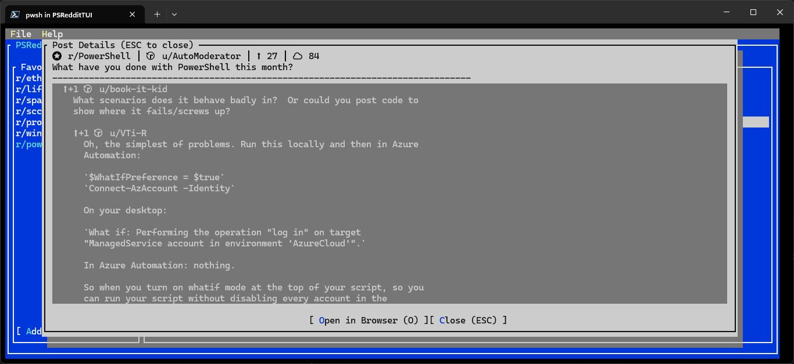

# PSRedditTUI

[](https://github.com/jorgeasaurus/PSRedditTUI/actions/workflows/ci.yml)
[](https://www.powershellgallery.com/packages/PSRedditTUI)
[](https://github.com/jorgeasaurus/PSRedditTUI)

A PowerShell module for browsing Reddit in a Terminal UI (TUI) using Spectre.Console




## Features

- 🖥️ **Terminal User Interface**: Built with PwshSpectreConsole (Spectre.Console) for a beautiful, interactive console experience
- ⭐ **Favorites Management**: Save and quickly access your favorite subreddits
- 🔍 **Search**: Search within subreddits or across all of Reddit
- 📊 **Sort & Filter**: Browse by hot, new, top, or rising with time filters (hour/day/week/month/year/all)
- 💬 **View Comments**: Read post content and comments with proper threading and indentation
- 🌐 **Open in Browser**: Quickly open any post in your default web browser
- 📝 **Comprehensive Logging**: Built-in logging for debugging and troubleshooting
- 🚀 **Reddit JSON API**: No authentication required for public subreddits
- 🔄 **Cross-Platform**: Works on Windows, macOS, and Linux with PowerShell 7+
- 🎨 **Rich Console Output**: Beautiful tables, panels, and colored text using Spectre.Console

## Requirements

- PowerShell Core 7.0 or higher
- PwshSpectreConsole module (version 2.0.0 or higher)

## Installation

### From PowerShell Gallery (Recommended)

```powershell
# Install PwshSpectreConsole (required dependency)
Install-Module -Name PwshSpectreConsole -Scope CurrentUser

# Install the module
Install-Module -Name PSRedditTUI -Scope CurrentUser

# Import and run
Import-Module PSRedditTUI
Show-RedditTUI
```

### From Source

1. Clone the repository:

```powershell
git clone https://github.com/jorgeasaurus/PSRedditTUI.git
cd PSRedditTUI
```

2. Install PwshSpectreConsole dependency:

```powershell
Install-Module -Name PwshSpectreConsole -Scope CurrentUser
```

3. Import and run:

```powershell
Import-Module ./PSRedditTUI.psd1
Show-RedditTUI
```

## Usage

### Launch the Terminal UI

```powershell
# Start with default subreddit (popular)
Show-RedditTUI

# Start with a specific subreddit
Show-RedditTUI -InitialSubreddit "powershell"
```

### Navigation

The TUI uses a menu-based interface. Use arrow keys to navigate and Enter to select options.

**Main Menu:**
- 📖 Browse Subreddit - View and browse posts from the current subreddit
- ⭐ Manage Favorites - Add, remove, or select favorite subreddits
- 🔍 Search Reddit - Search for posts within a subreddit or across all of Reddit
- ⚙️ Settings - View logs, clear logs, and set log level
- ❌ Exit - Close the application

**Browse Subreddit Menu:**
- 📋 View Posts - Display posts from current subreddit with current sort settings
- 🔄 Change Subreddit - Enter a different subreddit to browse
- 📊 Change Sort - Change sorting (hot, new, top, rising) and time filter
- ⬅️ Back to Main Menu

### Managing Favorites

#### In the Terminal UI:
1. Select "⭐ Manage Favorites" from the main menu
2. Choose "➕ Add New Favorite" to add a subreddit
3. Choose "📋 View/Select Favorite" to browse your favorites
4. Choose "➖ Remove Favorite" to remove a subreddit from favorites

#### From PowerShell:

```powershell
# Add a favorite subreddit
Add-Favorite -Subreddit "powershell"

# Remove a favorite subreddit
Remove-Favorite -Subreddit "powershell"

# View all favorites
Get-Favorites
```
### Fetch Reddit Data Programmatically

All the Reddit API functions remain unchanged and work exactly as before:

```powershell
# Get posts from a subreddit
$posts = Get-RedditPosts -Subreddit "powershell" -Sort "hot"

# Get top posts from the last month
$posts = Get-RedditPosts -Subreddit "sysadmin" -Sort "top" -Time "month"

# Get comments for a post
$comments = Get-RedditComments -Permalink "/r/powershell/comments/abc123/post_title/"

# Search within a subreddit
$results = Search-Reddit -Query "automation" -Subreddit "powershell"

# Search all of Reddit
$results = Search-Reddit -Query "terminal ui" -Sort "relevance"

# Display post information
$posts | Select-Object Title, Score, NumComments, Author | Format-Table
```

### Logging

```powershell
# View recent log entries
Get-PSRedditTUILog -Tail 20

# Set log level (Debug, Info, Warning, Error)
Set-PSRedditTUILogLevel -Level Debug

# Clear log file
Clear-PSRedditTUILog
```

## How It Works

PSRedditTUI uses Reddit's JSON API by appending `.json` to Reddit URLs. This allows the module to fetch data without requiring authentication for public subreddits.

Example:
- URL: `https://www.reddit.com/r/powershell/top?t=month`
- Becomes: `https://www.reddit.com/r/powershell/top.json?t=month`

## Limitations

### API and Data Limitations

- **Limited Posts per Request**: Reddit's JSON API returns approximately 25 posts per request by default. This is a Reddit API limitation, not a module limitation. The module displays all posts returned by Reddit in a single request.

- **Limited Comments**: The `Get-RedditComments` function defaults to fetching 50 top-level comments. Deeply nested comment threads may be truncated.

- **Dependency on Reddit's JSON URL Feature**: This module relies entirely on Reddit's undocumented feature of appending `.json` to URLs to fetch data. **If Reddit removes or changes this feature, the module will break.** This is an unofficial API endpoint not guaranteed by Reddit.

- **No Authentication**: The module only accesses public subreddit data. Private subreddits, user-specific feeds (like your homepage), and authenticated actions (voting, posting, saving) are not supported.

- **No Pagination**: The module does not currently support loading more posts beyond the initial batch returned by Reddit. Future versions may add "load more" functionality.

- **Rate Limiting**: Reddit may rate-limit requests. Excessive queries in a short time may result in temporary blocks. The module does not implement retry logic or rate limit handling.

### Terminal UI Limitations

- **Menu-Based Interface**: The new interface uses a menu-based navigation system powered by Spectre.Console. This provides a cleaner, more modern interface compared to the previous Terminal.Gui implementation.

- **Post Display Limit**: For performance reasons, only the top 20 posts are displayed in selection menus. All posts are shown in the table view.

- **Comment Display Depth**: Comments are displayed up to 3 levels deep by default to maintain readability.

- **Terminal Compatibility**: Requires a terminal that supports ANSI escape codes. Most modern terminals (Windows Terminal, iTerm2, GNOME Terminal, etc.) are supported.

### Platform Notes

- Requires PowerShell 7.0+ (PowerShell Core). Windows PowerShell 5.1 is not supported.
- Cross-platform: Works on Windows, macOS, and Linux
- Best experience with modern terminal emulators that support rich text formatting

## Favorites Storage

Favorites are stored locally in `~/.psreddittui_favorites.json` and persist between sessions.

### Default Favorites on First Launch

When you launch PSRedditTUI for the first time, the favorites sidebar is automatically populated with **11 curated subreddits** to get you started:

#### Tech-Focused Communities
- `powershell` - PowerShell community and discussions
- `windows` - Windows OS community
- `microsoft` - Microsoft products and news
- `technology` - Tech news and discussions

#### General Interest
- `popular` - Trending posts across Reddit
- `all` - All public posts
- `news` - Current news
- `gaming` - Gaming community

#### Community & Knowledge
- `lifeprotips` - Life tips and advice (LPT)
- `todayilearned` - Interesting facts (TIL)
- `askreddit` - Community Q&A

**Note:** You can add or remove any of these defaults just like any other favorite. The defaults are only created on first launch; your customized favorites will persist for all future sessions.

## Exported Functions

| Function | Description |
|----------|-------------|
| `Show-RedditTUI` | Launch the Terminal UI browser (menu-based interface) |
| `Get-RedditData` | Fetch raw data from Reddit JSON API |
| `Get-RedditPosts` | Get posts from a subreddit with sorting options |
| `Get-RedditComments` | Get comments for a specific post |
| `Search-Reddit` | Search within a subreddit or all of Reddit |
| `Get-Favorites` | Load favorites from local storage |
| `Add-Favorite` | Add a subreddit to favorites |
| `Remove-Favorite` | Remove a subreddit from favorites |
| `Get-PSRedditTUILog` | View log entries |
| `Set-PSRedditTUILogLevel` | Set logging verbosity |
| `Clear-PSRedditTUILog` | Clear the log file |

## Building from Source

```powershell
# Install build dependencies and run full CI pipeline
./build.ps1 -Task CI

# Run only tests
./build.ps1 -Task Test

# Run only static analysis
./build.ps1 -Task Analyze

# Build module for distribution
./build.ps1 -Task Build
```

## Troubleshooting

### PwshSpectreConsole Module Not Found

The module requires PwshSpectreConsole to run the TUI. Install it with:

```powershell
Install-Module -Name PwshSpectreConsole -Scope CurrentUser
```

If you encounter installation issues, you may need to register the PowerShell Gallery:

```powershell
Register-PSRepository -Default
Install-Module -Name PwshSpectreConsole -Scope CurrentUser
```

### PowerShell version

This module requires PowerShell Core 7+. Check your version:

```powershell
$PSVersionTable.PSVersion
```

If you're using Windows PowerShell 5.1, install PowerShell 7:
- Download from: https://github.com/PowerShell/PowerShell/releases

### View debug logs

```powershell
Set-PSRedditTUILogLevel -Level Debug
Show-RedditTUI
Get-PSRedditTUILog -Tail 50
```

## License

This project is open source.

## Contributing

Contributions are welcome! Please feel free to submit issues or pull requests.

### Development

1. Fork the repository
2. Create a feature branch
3. Make your changes
4. Run `./build.ps1 -Task CI` to verify tests pass
5. Submit a pull request
